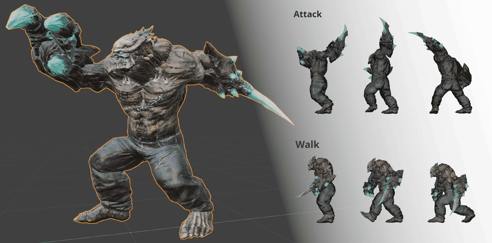
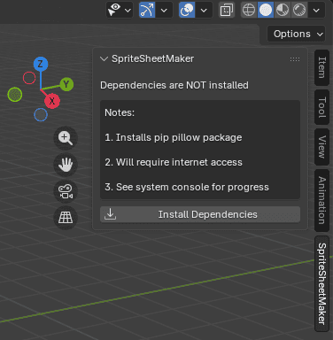
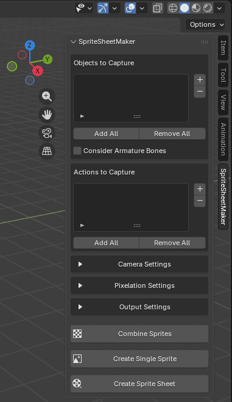
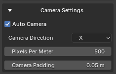
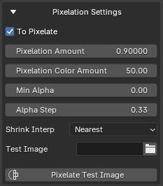

# 🖼️ Sprite Sheet Maker


An addon to convert your 3D animations into 2D sprite sheets with in-built toggleable pixelation



>📜 _Tip:  
> If you only want the core functionality for your own project and not the UI then take a look at these files:_  
> 1. combine_frames.py  
> 1. sprite_sheet_maker_utils.py  
> 1. install_dependencies.py


## ⭐ Features
1. Highly customizable while also having organized settings
2. Allows assigning which actions to add to the sheet
3. Allows assigning which objects to render into the sheet
4. Adds auto camera while also allowing for custom camera
5. Automatic labeling of each sprite strip based on action with control over font size
6. Allows single sprite creation for checking assigned settings first
7. In-built pixelation tool with complete control over amount of pixels & color
8. Simple 2D images can also be pixelated without anything 3D required
9. Allows recontinuing in case of failure
10. Combining all sprites within a folder into a sheet with no rendering required 


## 🛠️ How to install?
1. Download this repo as .zip file (you can delete `/images` folder)
2. Go to _Edit -> Preferences -> Add-ons -> Install from Disk_ and select the .zip file (make sure it's enabled once installed)
3. If it has been successfully installed you should see it appear on the side panel as such:

   

4. Make sure you have internet access (one time only) & click on the `Install Dependencies` button and wait for a few minutes, If the installation was successful you should now see the panel changed as such:

     


## 🧭 Usage
1. **Objects to Capture:**   
   This contains a list of all objects within the scene that are to be added to the sprite or sprite sheet, Any object not in this list will be hidden during rendering

2. **Consider Armature Bones:**  
   If this is enabled then the bones of the armature(s) are also taken into consideration when calculating the size of each sprite frame

3. **Actions to Capture:**  
   This contains a list of all actions which are to be added into the sprite sheet i.e. 1 action = 1 row & 1 frame = 1 sprite in the sheet

4. **Camera Settings**  
       

    1. **Auto Camera:**  
       If checked then a camera will be auto created for you & deleted after creation of sprite sheet
    
    2. **Camera Direction:**  
       Which direction should the auto camera be facing from while rendering sprites

    3. **Pixels Per Meter:**  
       How many pixels each meter translates to in your sprite sheet (Don't use this for pixelation it will give blurry images, Look at `Pixelation Amount` instead)
    
    4. **Camera Padding:**  
       Amount of gap to keep from border of the camera while capturing objects 
    
    5. **Camera Object:** (Only shows when `Auto Camera` is off)  
       Use this if you wish to set your own camera to capture each sprite, Using this means you must fully manage the camera yourself e.g. keeps all objects in frame, following them as they move, etc
    
5. **Pixelation Settings**  
       

    1. **To Pixelate:**  
       If this is unchecked the entire process of pixelation will be skipped
    
    2. **Pixelation Amount:**  
       By what factor to pixelate the sprites, Higher the value the more the sprites will be pixelated

    3. **Pixelation Color Amount:**   
       This controls the "Value" in HSV color of the sprite

    4. **Min Alpha:**  
       If any pixel in the sprite has a transparency less than this amount then it is discarded (If you would like to remove all semi-transparent pixel set this to 1.0)
    
    5. **Alpha Step:**  
       Ensures that all pixels have a transparency which is a multiple of this amount

    6. **Shrink Interp:**  
       Which interpolation method to use while shrinking the rendered image into pixelated version

    7. **Test Image:**  
       Provide an image on which to apply the pixelation settings (useful for testing pixelation settings before applying to entire sheet)

    8. **Pixelate Test Image:**  
       Generates a pixelated version of the image provided, This is purely for testing purposes on the provided image, this button will not effect your sprite sheet in any way (You can also think of this as a standalone pixelizer for images)

6. **Output Settings**  
       

    1. **Label Font Size:**  
       The font size of the action name labels in sprite sheet, If you do not want labels in your sprite sheet you can set it to 0
    
    2. **Frame Margin:**  
       Margin, in pixels, that should be applied around each sprite frame

    3. **Output Folder:**  
       Folder in which the sprite sheet is rendered & saved

    4. **Delete Temp Folder:**  
       Should the temp folder be deleted after creating the sprite sheet (Look at "How this works?" section to learn more)

7. **Combine Sprites:**  
   Combines all images in the selected `Output Folder` into one sprite sheet but only given it follows the required structure as mentioned in `How this works?` (useful if your sprite sheet creation was previously interrupted)

8. **Create Single Sprite:**  
   This renders a single sprite with all settings applied, Only `Actions to Capture` is ignored and instead generates sprite in whatever is currently in the viewport

9. **Create Sprite Sheet:**  
   This creates the entire sprite sheet at the specified `Output Folder`, While creating you might see a temp folder by the name of "SpriteSheetMakerTemp" do not delete it otherwise the sheet won't be created properly 


## ⚙️ How this works?
1. Iterates over each action frame by frame
2. (If Auto Camera) Calculates bounding box based on objects to capture
3. (If Auto Camera) Sets camera according to bounding box
4. Renders image & stores into a temp folder based on action as sub folder & frame number, The folder structure is as such:
   ```
   SpriteSheetMakerTemp/
   ├── 0_Idle/
   │   ├── 1.png
   │   └── 2.png
   ├── 1_Running/
   │   ├── 1.png
   │   └── 2.png
   └── 2_Attacking/
      ├── 1.png
      └── 2.png
   ```
   You can see this folder if you uncheck `Delete Temp Folder`
5. (If To Pixelate) Re-renders the image pixelated via compositor, If compositor node group not found then it is appended from `SpriteSheetMaker.blend`
6. Once all images are rendered, retrieves them from temp folder and uses `pillow` package to stitch together all images (while also adding labels based on action name) into a single sprite sheet


## ❓ Common Questions
**_Why is my sprite empty / not showing?_**  
1. Make sure you've added the desired objects to `Objects to Capture`
2. Make sure `Pixels Per Meter` isn't 0 or too small 
3. Make sure you've added lights  
4. Make sure if `Auto Camera` is unchecked your own camera is setup properly
5. Try rendering on your own before using this addon to see if the issue persists  

<br/>

**_Why is "Create Single Sprite" changing the poses of objects & armatures?_**  
This is not an addon issue it's just how Blender works while rendering, Try unlinking the actions from the objects & armatures first then create the single sprite

<br/>

**_Why is Blender crashing when I try to create a sprite sheet?_**  
1. You might be trying to render an image that is too big i.e. the value of `Pixels Per Meter` is too high or you're trying to capture a really big object with too much resolution, Try rendering without the plugin first to see if the issue still persists
2. You might be trying to render too many frames and your system might not be able to handle it

<br/>

**_How do I see the progress of sprite sheet creation?_**  
You need to open Blender via [console](https://www.youtube.com/watch?v=ijngHwCoDQo) where you can see exactly what the plugin is currently doing


## Credits
1. [robertguetzkow github - Install Dependencies](https://github.com/robertguetzkow/blender-python-examples/tree/master/add_ons/install_dependencies)

2. [Default Cube YouTube - I Am A Pixel Art Master](https://www.youtube.com/watch?v=AQcovwUHMf0)