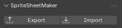
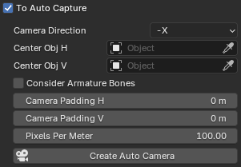
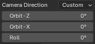
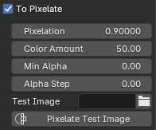
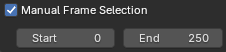

# 🖼️ Sprite Sheet Maker


A blender addon to convert your 3D animations into 2D sprite sheets with in-built toggleable pixelation


## 🪄 Features
1. Highly customizable
2. Inbuilt auto camera
3. Labeling for each strip
4. Allows single sprite creation
5. In-built pixelation tool
6. Options for combining into sheet, strips or images
7. Maintains sprite dimension consistency
8. Recontinuing in case of failure  
9. Supports perspective & orthographic camera
10. Import/Export settings


>📜 **Tip:**  
> If you want to reuse the core functionality without the UI in your own code base look inside the `modules/` folder.  
>
> _If you use these in your own project, attribution is appreciated! Also feel free to leave a ⭐_


## 🛠️ How to install?
1. Download the plugin from [releases](https://github.com/ManasMakde/SpriteSheetMaker/releases/) or official [blender extension](https://extensions.blender.org/add-ons/sprite-sheet-maker/) site
2. If installed from releases, Go to _Edit -> Preferences -> Add-ons -> Install from Disk_ and select the .zip file (make sure it's enabled once installed)
3. If the installation was successful you should now see the panel as such:  
     


## 📖 Terminology  
  
  


## 🧭 Usage

1. **Export/Import:**  
   

   You can use these buttons to export or import your current plugin values for future reusability.  
   The values are saved as `.json` file and hence they can also be modified externally.


1. **Animation Strips:**   
      

   Each one of these represent a row within a sprite sheet.  
   You can duplicate by using the  button.  
   You can add or remove them using the + and - buttons on the side.  
   You can reorder them using the arrow ▲ and ▼ buttons on the side.

   > **Note:**  
   > The order of strips in this list corresponds to the order in which they appear in the sprite sheet.


1. **Strip Info:**  
      

   This shows the properties of whichever strip is **selected** in `Animation Strips`, If it is grayed out & disabled then it mean you have to add a strip first.
   
   You can preview all the actions to be rendered in this strip by pressing ▶︎ button.
   

   -  **Sync Button:**   
      If enabled (i.e. in-sync), The `Custom Camera`, `Auto Capture` & `Pixelate` Properties stay in sync with all other strips which have this button enabled.  
      
      If disabled, Changing properties for that strip won't effect other strips.   
      
      If you hold `Alt` and then click on this button, the properties of the current strip will be synced onto all the other strips that are in-sync.  

   
   -  **Label:**  
      This is the text that will be added on top of the strip in the sprite sheet.

   - **Capture Items:**  
      These are all the objects that will be captured within a single strip, Use + and - buttons on the side to add & remove items. Once an item is created it will have 3 inputs:  
      `Object`: This refers to the object that should be captured  
      `Action`: This refers to what action the aforementioned object should be playing  
      `Slot`: This refers to [action slot](https://www.youtube.com/watch?v=N4GlTIz66EA) to be used (leave blank if you're unsure)  

   - **Custom Camera:**  
      If provided, this camera will be used to capture images


1. **To Auto Capture**  
   

   These settings will only show up when check box is enabled.  

   If enabled and `Custom Camera` is provided then it will be used, If not provided a new camera will be created and will later be deleted after the sprite sheet is created.  
   
   Basically "Auto Capture" modifies the camera automatically such that the bounding box of all capture item objects are perfectly encapsulated within the camera view for each frame of the animation. 

   - **Camera Direction:**  
      From which direction should the camera be capturing images.  
      Available options: `x`, `y`, `z`, `-x`, `-y`, `-z`, `Custom`  
      Incase `Custom` is selected 3 more inputs will show up.  

        
      **Orbit-Z:** The orbiting z rotation around all capture items.  
      **Orbit-X:** The orbiting x rotation around all capture items.  
      **Roll:**  The [roll][Roll Wiki] rotation of the camera itself.

   - **Center Obj H:**  
      If assigned, This object's origin will always be in the horizontal center of the camera view.  
   - **Center Obj V:**  
      If assigned, This object's origin will always be in the vertical center of the camera view.  
      If the assigned center object is an armature & `Bone` is provided, Then the location of the bone head will be used. 

   - **Consider Armature Bones:** If disabled, the bounding box of the armature will ignored during "Auto Capture" (This feature was added so you can avoid pesky leaf bones from being captured).
  
   - **Camera Padding H:**  
      Amount of horizontal padding surrounding the view of the camera.
   
   - **Camera Padding V:**  
      Amount of vertical padding surrounding the view of the camera.
   
   - **Pixels Per Meter:**  
      How many pixels each meter translates to in your sprite sheet.  
      (Don't use this for pixelation, instead use `Pixelation Amount`)

   - **Create Auto Camera:**  
      This will create a camera with the auto capture properties applied to it.  
      If `Custom Camera` is assigned then it will apply the auto capture properties to it instead of creating a new camera.


1. **To Pixelate:**  
     

   These settings will only show up when check box is enabled.  
   If enabled then the sprites of this strip will be pixelated.  

   - **Pixelation:**  
      By how much to pixelate the sprites, Higher the value the more the sprites will be pixelated.

   - **Color Amount:**   
      This controls the "Value" in HSV color of the sprite.

   - **Min Alpha:**  
      If any pixel in the sprite has a transparency less than this amount then it is discarded (If you would like to remove all semi-transparent pixel set this to 1.0).

   - **Alpha Step:**  
      Ensures that all pixels have a transparency which is a multiple of this amount, Keep at 0.0 to disable.

   - **Test Image:**  
      Provide an image on which to apply the pixelation settings (useful for testing pixelation settings before applying to entire sheet).

   - **Pixelate Test Image:**  
      Generates a pixelated version of the test image provided. This is purely for testing purposes on the provided image, this button will not effect your sprite sheet in any way (You can also think of this as a standalone pixelizer for images).


1. **Manual Frame Selection:**  
     

   If enabled, you can manually set the **Start** & **End** frames (inclusive) to capture in the strip.  
   If disabled, The start & end frame of longest duration action will be taken.


1. **Output Settings**  
      

   - **Label Font Size:**  
      The font size of the action name labels in sprite sheet, If you do not want labels in your sprite sheet you can set it to 0.  

   - **Surrounding Margins:**  
      Margin, in pixels, that should be applied around the borders of the entire sprite sheet.  
   
   - **Label Margin:**  
      Vertical margin, in pixels, between the label and the images.  
   
   - **Image Margin:**  
      Horizonal margin, in pixel, between images within a row.  
   
   - **Sprite Consistency:**  
      This dictates what the dimensions of the sprites should be with respect to other sprites.    
      `Individual Consistent`: Every sprite keeps to its own content's width while matching the height of its row i.e. All sprites have their own dimensions.  
      `Row Consistent`: Every sprite in the row matches the row's widest sprite in width and tallest sprite in height i.e. All sprites in a row have the same dimensions.  
      `All Consistent`: Every sprite in the sheet matches the widest sprite in width and tallest sprite in height i.e. All sprites have the same dimensions.  
   
   - **Sprite Align:**  
      Decides how the content should be aligned within the sprite cell.
   
   - **Combine Mode:**  
      `Images`: Creates all sprites in separate files.  
      `Strips`: Creates each row as a seperate file.   
      `Sheet`: Creates a complete sprite sheet as a single file.  

   - **Delete Temp Folder:**  
      If enabled, The temporary folder is deleted after creating the sprite sheet.  

   - **Temp Folder:**  
      Used as input for `Combine Sprites`.

   - **Combine Sprites:**  
      Combines all images in the selected `Temp Folder` into one sprite sheet but only given that it follows the following structure:

      ```
      SpriteSheetMakerTemp/
      ├── 0_Idle/
      │   ├── 1.png
      │   └── 2.png
      ├── 1_Running/
      │   ├── 1.png
      │   └── 2.png
      └── 2_Attacking/
         ├── 1.png
         └── 2.png
      ```

2. **Output Folder:**  
   Folder in which the newly created sprite sheet is saved.

3. **Create Single Sprite:**  
   This renders a single sprite with all settings applied. The label for it is taken from the first `Animation Strip` item.

4. **Create Sprite Sheet:**  
   This creates the entire sprite sheet (or whichever `Combine Mode` is specified) at the given `Output Folder`, While creating you might see a temp folder by the name of "SpriteSheetMakerTemp" do not delete it otherwise the sheet won't be created properly. 


## 🗺️ Example


## ❓ Common Questions
**_Why is my sprite empty / not showing any objects?_**  
1. Make sure you've added the desired objects to `Objects to Capture`.
2. Make sure `Pixels Per Meter` isn't 0 or too small.
3. Make sure if `To Auto Capture` is unchecked your own camera is setup properly.
4. Make sure `Pixelation Amount` isn't too much.
5. Make sure `Min Alpha` & `Alpha step` aren't exceeding 1.0.
6. Make sure you've added lights.
7. Try rendering on your own before using this addon to see if the issue persists.

<br/>

**_Why do strips contain the same or invalid animation?_**  
Make sure you have assigned the correct actions & slots in "Capture Items" for all strips.

<br/>

**_Why is my content improperly cut off?_**  
Make sure you have assigned the correct objects in "Capture Items" for all strips.

<br/>

**_Why is "Create Single Sprite" changing the poses of objects & armatures?_**  
This is not an addon issue it's just how Blender works while rendering, Try unlinking the actions from the objects & armatures first then create the single sprite.

<br/>

**_Why is Blender crashing when I try to create a sprite sheet?_**  
1. You might be trying to render an image that is too big i.e. the value of `Pixels Per Meter` is too high or you're trying to capture a really big object with too much resolution, Try rendering without the plugin first to see if the issue still persists.
2. You might be trying to render too many frames and your system might not be able to handle it.

<br/>

**_How do I see the progress of sprite sheet creation?_**  
You need to open Blender via [console](https://www.youtube.com/watch?v=ijngHwCoDQo) where you can see exactly what the plugin is currently doing.

<br/>

**_Why isn't the background transparent?_**  
1. This is not a plugin issue, you have to manually set it in `Render Properties > Film > Transparent` and enable it as shown [here](https://www.youtube.com/watch?v=kgqvS69_X98).
2. Make sure Output `Properties > Color` is set to RGBA & that `File Format` is .png.

<br/>

**_How to recontinue interrupted rendering of sprite sheet?_**  
1. Locate the incomplete "SpriteMakerTemp" folder (or whichever folder you were rendering your sprite frames into) and see which actions have not rendered all frames or are missing.
2. Then add those missing/incomplete actions to `Actions to Capture` and uncheck the `Delete Temp Folder` and creating a spritesheet (to get a new "SpriteMakerTemp").
3. Merge the old and new "SpriteMakerTemp" folders together according to the structure mentioned in "How this works?".
4. Then use the `Combine Sprites` button to get a complete spritesheet.

<br/>

**_Why do my objects not perfectly fit into camera view (especially perspective) when creating auto camera?_**  
1. Make sure the desired objects are added into the capture items list.
2. The auto camera perfectly fits the **bounding box** into the view not the object vertices themselves since that would be computationally very expensive.

<br/>

> **Note:**  
> Remember this is just a tool to help with your workflow and if you want to make really good art I recommend you also paint over the spritesheet yourself 🙂


## 👨‍💻 Development

1. Clone this repo
   ```
   git clone https://github.com/ManasMakde/SpriteSheetMaker
   ```
2. Switch to whichever branch you want to modify
   ```
   git switch <branch-name>
   ```
3. (Optional) Install [Blender Development Plugin](https://marketplace.visualstudio.com/items?itemName=JacquesLucke.blender-development) to ease workflow

4. After you're done making changes, Build the zip files with the following command
   ```
   python build.py
   ```
5. (For maintainer only) Upload all generated .zip files separately one by one to https://extensions.blender.org/

> **Note:**  
> Do not upload all zip files all at once it does not work


## 🤝 Contribution
You can contribute in the following ways:
1. Report bugs or suggest features by opening a [new issue](https://github.com/ManasMakde/SpriteSheetMaker/issues/new).
2. Write test cases.
3. Sponsor this project.


## ❤️ Sponsor
If this addons has been useful in your projects consider [supporting][Sponsor] its development.  
Any support motivates to keep the project well maintained, documented & growing.


## 🏆 Credits
1. [Default Cube YouTube - I Am A Pixel Art Master](https://www.youtube.com/watch?v=AQcovwUHMf0)


## 🔑 License  
MIT © [Manas Ravindra Makde](https://manasmakde.github.io/)


[Roll Wiki]: https://simple.wikipedia.org/wiki/Pitch,_yaw,_and_roll
[Sponsor]: https://github.com/sponsors/ManasMakde
